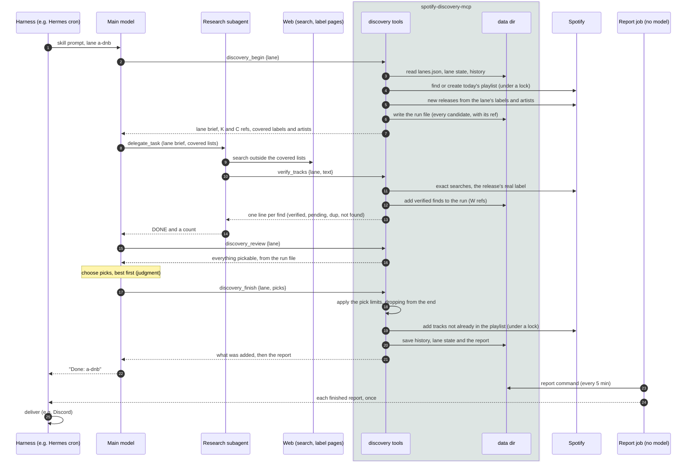

# Discovery tools: a worked example

This page follows one lane run from start to finish: what each tool takes, what it returns, and where every line of the report comes from. The README explains the pick rules; [design.md](design.md) covers the files and the reasoning behind each step.

The lane, artists, labels and URLs are made up. Every block marked *output* is real, though: `test/docs-example.test.ts` runs this exact scenario through the server against `test/fake-spotify.ts`, using the arguments shown here, and fails if any output on this page no longer matches.

## The whole run



The main model never handles a track, URI, playlist id or the subagent's finds. It judges at one point: which refs to pick, in what order. The research subagent hands its finds straight to the server, and the report reaches the user through a separate job, so the model can't mangle either.

**Where each part of the report comes from**

| Part of the report | Written by |
|---|---|
| Artist, title, label, release date, playlist link | The server, from Spotify (the label from the release's ℗ line, not from the source) |
| The reason after a web find, and its source link | The research subagent's text, passed through `verify_tracks` unchanged |
| The reason after a K or C pick | The main model, in `discovery_finish`'s `why` (optional) |
| What was dropped, already recommended or pending | The server |
| Layout | The server (`src/discovery/render.ts`) |

## 1. `discovery_begin`

Finds or creates today's playlist, fetches new releases from the lane's labels and artists, and writes a run file. It changes no lane state; `discovery_finish` applies what it learned.

<!-- args: discovery_begin -->
| Field | Meaning |
|---|---|
| `lane` | The lane id from `lanes.json` |

The example lane has two seed labels and one artist. Its history already has one track, and this is its first run.

<!-- example: discovery_begin -->
```json
{ "lane": "a-dnb" }
```

Output:

<!-- generated: discovery_begin -->
```text
Lane a-dnb: Neurofunk and techstep
Today's playlist: hermes20261006 (0 tracks so far)
Baseline: Dark, technical drum & bass: neurofunk, techstep and halftime.
Research note: Releases are sparse; two great fits beat six average ones.
Pick up to 6 (aim for 3–6; fewer is fine if nothing else fits). At most 3 from K/C refs unless no web find verifies. At most 2 by core artists.

New from known labels and artists (since 2026-09-22):
K1  Kestrel — Hollow Ground · single, 2026-10-01 · Ferrous Records [core artist]
K2  Pressure Front (single, 2026-09-30, Obsidian Audio) · 2 tracks:
    K2.1  Mara Voss — Pressure Front · Obsidian Audio
    K2.2  Mara Voss — Undertow · Obsidian Audio
K3  Night Shift (single, 2026-09-27, Ironclad Music) · 3 tracks:
    K3.1  Dekker — Night Shift · Ironclad Music
    K3.2  Dekker — Rivet · Ironclad Music
    K3.3  Dekker — Coldline · Ironclad Music

Covered labels (research should look elsewhere): Obsidian Audio, Ironclad Music
Covered artists: Kestrel
```

Things to notice:

- **A multi-track release is one group with numbered tracks** (`K2`, `K2.1`, `K2.2`). The model can pick the group or a track; picking `K2` means its first track.
- **The 2024 release on Obsidian Audio isn't listed.** It's older than the run's start date ("since 2026-09-22": a first run looks back two weeks).
- **`[core artist]`** marks an artist from `taste_profile.json`. Those count toward `max_core_picks`.
- **The covered lists** tell the research where *not* to look. The skill copies them into the subagent's goal.

## 2. Web research and `verify_tracks`

The research subagent searches outside the covered lists and calls `verify_tracks` itself, with its finds as plain lines. The server checks each one on Spotify and gives it a `W` ref.

<!-- args: verify_tracks -->
| Field | Meaning |
|---|---|
| `lane` | The lane id |
| `text` | The finds, one per line: `artist \| track \| release \| label \| release date \| why, attributed \| source URL`. Lines starting `LABEL \|` record a new label. Bullets, numbering and bold are ignored |
| `candidates` | Alternative to `text`: the same fields as objects (`artist`, `track`, `release`, `label`, `released`, `why`, `source_url`) |

It can be called as often as needed; refs keep counting up. The example's arguments:

<!-- example: verify_tracks -->
```json
{
  "lane": "a-dnb",
  "text": "Vanta | Signal Loss | Signal Loss | Deepcut Records | 2026-10-02 | Sublevel Recordings: 'a slow-burning halftime roller' | https://example.com/sublevel/signal-loss\nAsh Meridian | Fever Line | Fever Line EP | Ironclad Music | 2026-10-23 | Ironclad: 'out on the 23rd' | https://example.com/ironclad/fever-line\nHollow Point | Static Bloom | Static Bloom | Ironclad Music | 2025-06-01 | Ironclad: 'their heaviest yet' | https://example.com/ironclad/static-bloom\nLumen Drift | Glass Engine | Glass Engine | Sublevel Recordings | 2026-09-29 | Sublevel Recordings: 'clinical neurofunk built from field recordings' | https://example.com/sublevel/glass-engine\nLABEL | Sublevel Recordings | https://example.com/sublevel | Halftime and neurofunk label"
}
```

Output:

<!-- generated: verify_tracks -->
```text
W1 ✓ Vanta — Signal Loss · 2026-10-02 · Sublevel Recordings [core artist]
    ⚠ label is Sublevel Recordings, not Deepcut Records as the source said
W2 pending Ash Meridian — Fever Line · not on Spotify (yet); re-checked each run
W3 dup Hollow Point — Static Bloom · recommended 2026-09-18 (a-dnb)
W4 ✓ Lumen Drift — Glass Engine · 2026-09-29 · Sublevel Recordings
Labels noted for this lane: Sublevel Recordings

2 of 4 verified. Pick by ref (W, K or C) in discovery_finish, best first.
```

The four outcomes:

- **✓ verified:** found with an exact search, so it can be picked. When the release's ℗ line names a different label from the source, the line says so, and the report uses the real one.
- **pending:** not on Spotify yet (the release date is in the future). It's kept and re-checked by every run for `pending_days`, then offered as a `C` ref once it's out.
- **dup:** already recommended, here by this lane on 2026-09-18. It can't be picked, and the report mentions it.
- **✗ not found:** no exact match. It isn't added (none in this example).

The subagent then replies only "DONE" and a count, so none of this text passes through the main model.

## 3. `discovery_review`

Lists everything pickable in the run from the server's own run file: verified web finds with their reasons, then the known-source tracks, and the limits.

<!-- args: discovery_review -->
| Field | Meaning |
|---|---|
| `lane` | The lane id |

<!-- example: discovery_review -->
```json
{ "lane": "a-dnb" }
```

Output:

<!-- generated: discovery_review -->
```text
Lane a-dnb: Neurofunk and techstep
Baseline: Dark, technical drum & bass: neurofunk, techstep and halftime.
Pick up to 6 (aim for 3–6; fewer is fine if nothing else fits). At most 3 from K/C refs unless no web find verifies. At most 2 by core artists.

Web finds, verified on Spotify (2):
W1  Vanta — Signal Loss · single, 2026-10-02 · Sublevel Recordings [core artist]
    why: Sublevel Recordings: 'a slow-burning halftime roller'
    ⚠ label is Sublevel Recordings, not Deepcut Records as the source said
W4  Lumen Drift — Glass Engine · single, 2026-09-29 · Sublevel Recordings
    why: Sublevel Recordings: 'clinical neurofunk built from field recordings'
Not pickable: W2 Ash Meridian — Fever Line (pending); W3 Hollow Point — Static Bloom (dup)

From known labels and artists (6):
K1  Kestrel — Hollow Ground · single, 2026-10-01 · Ferrous Records [core artist]
K2.1  Mara Voss — Pressure Front · single, 2026-09-30 · Obsidian Audio
K2.2  Mara Voss — Undertow · Pressure Front, single, 2026-09-30 · Obsidian Audio
K3.1  Dekker — Night Shift · single, 2026-09-27 · Ironclad Music
K3.2  Dekker — Rivet · Night Shift, single, 2026-09-27 · Ironclad Music
K3.3  Dekker — Coldline · Night Shift, single, 2026-09-27 · Ironclad Music

Next: call discovery_finish with your picks as refs, best first.
```

## 4. `discovery_finish`

The model gives its picks as refs, best first. The server applies the lane's limits, adds the tracks to today's playlist, saves all state and returns the report.

<!-- args: discovery_finish -->
| Field | Type | Meaning |
|---|---|---|
| `lane` | string | The lane id |
| `picks` | ref[] | K, C or W refs, best first. Up to 30 |
| `why` | `{ref: reason}` | Optional reasons for K or C picks, quoted or attributed to a text source. W picks already have theirs. A plain sentence is accepted and ignored |
| `reject` | ref[] | Refs that don't fit the lane at all. They won't be offered again |
| `thin` | boolean | The research came back limited |
| `dry_run` | boolean | Show the report without adding or saving anything |

How the limits work: the server keeps the model's order and drops picks from the end until every limit holds, instead of refusing the call. An unknown ref is the only error, and then nothing is added or saved.

The example picks six. K3.3 is rejected, so it won't carry over:

<!-- example: discovery_finish -->
```json
{
  "lane": "a-dnb",
  "picks": ["W4", "W1", "K2.1", "K1", "K3.1", "K3.2"],
  "why": { "K2.1": "Obsidian Audio: 'a rolling techstep workout'" },
  "reject": ["K3.3"]
}
```

Output. The result tells the model its reply, "Done: a-dnb". The report below the marker is for the record; the report job in step 5 delivers it:

<!-- generated: discovery_finish -->
```text
Saved. Added 5 track(s) to hermes20261006.
Reply with one line: Done: a-dnb
===== REPORT (for the record: the report job delivers it, so don't repeat it) =====
**Lane:** Neurofunk and techstep
**Playlist:** hermes20261006 — <https://open.spotify.com/playlist/pl1>

**Added (5):**
- **Lumen Drift — Glass Engine** (Sublevel Recordings, 2026-09-29). Sublevel Recordings: 'clinical neurofunk built from field recordings' <https://example.com/sublevel/glass-engine>
- **Vanta — Signal Loss** (Sublevel Recordings, 2026-10-02). Sublevel Recordings: 'a slow-burning halftime roller' <https://example.com/sublevel/signal-loss> · *core artist*
- **Mara Voss — Pressure Front** (Obsidian Audio, 2026-09-30). Obsidian Audio: 'a rolling techstep workout'
- **Kestrel — Hollow Ground** (Ferrous Records, 2026-10-01) · *core artist*
- **Dekker — Night Shift** (Ironclad Music, 2026-09-27)

Dropped by limits: Dekker — Rivet (feed limit of 3)
Already recommended: Hollow Point — Static Bloom
Not on Spotify yet (re-checking each run): Ash Meridian — Fever Line <https://example.com/ironclad/fever-line>
New labels for this lane: Sublevel Recordings
```

What happened:

- **K3.2 was dropped by the feed limit.** The run has verified web finds, so at most 3 picks can come from K and C refs. K2.1, K1 and K3.1 used them up.
- **The core-artist limit held:** Vanta (W1) and Kestrel (K1) are the lane's 2.
- **Saved:** the five tracks went into the playlist and `history.json`. The picked artists that weren't seeds (Lumen Drift, Vanta, Mara Voss, Dekker) and Sublevel Recordings, from the `LABEL` line, went into `lanes/a-dnb.json`. Sublevel is already *promoted*, because two of the picks came from it; a found label nobody picks is dropped after `quiet_runs` quiet runs. All of this means the next run's feed covers them. The unpicked K tracks (Undertow, and Rivet, which the limit dropped) stay in the lane's pool and come back as `C` refs for up to `carry_runs` runs. Fever Line stays pending. Step 6 shows the saved state.
- **`last_run`** is when `discovery_begin` started (the server's clock), so releases that come out during the run turn up next time.

Calling `discovery_finish` again for the same run changes nothing and returns the same report.

## 5. Delivering the report

A separate no-model cron job runs `spotify-discovery-mcp report` every few minutes while the lanes run. It prints each finished report that hasn't been printed yet (tracked in `reports.json`), plus a ⚠ line for a run that started more than `--stall-minutes` (default 90) ago and never finished. When there's nothing new it prints nothing, which Hermes treats as a silent run. Five minutes after the example run:

<!-- generated: report -->
```text
**Lane:** Neurofunk and techstep
**Playlist:** hermes20261006 — <https://open.spotify.com/playlist/pl1>

**Added (5):**
- **Lumen Drift — Glass Engine** (Sublevel Recordings, 2026-09-29). Sublevel Recordings: 'clinical neurofunk built from field recordings' <https://example.com/sublevel/glass-engine>
- **Vanta — Signal Loss** (Sublevel Recordings, 2026-10-02). Sublevel Recordings: 'a slow-burning halftime roller' <https://example.com/sublevel/signal-loss> · *core artist*
- **Mara Voss — Pressure Front** (Obsidian Audio, 2026-09-30). Obsidian Audio: 'a rolling techstep workout'
- **Kestrel — Hollow Ground** (Ferrous Records, 2026-10-01) · *core artist*
- **Dekker — Night Shift** (Ironclad Music, 2026-09-27)

Dropped by limits: Dekker — Rivet (feed limit of 3)
Already recommended: Hollow Point — Static Bloom
Not on Spotify yet (re-checking each run): Ash Meridian — Fever Line <https://example.com/ironclad/fever-line>
New labels for this lane: Sublevel Recordings
```

## 6. Status and repairs

`discovery_status` is read-only. After the run above:

<!-- args: discovery_status -->
| Field | Meaning |
|---|---|
| `lane` | Optional: just this lane |

<!-- example: discovery_status -->
```json
{ "lane": "a-dnb" }
```

<!-- generated: discovery_status -->
```text
Today (2026-10-06): hermes20261006, 5 tracks <https://open.spotify.com/playlist/pl1>
History: 6 tracks recommended.

a-dnb — Neurofunk and techstep
  last run: 2026-10-06T13:00:00Z · pool 2 · pending 1
  seed labels: Obsidian Audio, Ironclad Music
  learned labels: Sublevel Recordings (promoted, 2 picks, quiet 0)
  learned artists: Lumen Drift, Vanta, Mara Voss, Dekker
  pending: Ash Meridian — Fever Line (since 2026-10-06)

Recent runs: a-dnb-20261006T130000Z
```

Two repair tools change state by hand, and the skill never calls them:

<!-- args: mark_recommended -->
| Field | Meaning |
|---|---|
| `lane` | The lane id |
| `tracks` | `"Artist — Title"` or Spotify track links (1–100). Added to the history, so they're never suggested |

<!-- args: forget -->
| Field | Meaning |
|---|---|
| `lane` | The lane id |
| `label` | A learned label to remove |
| `artist` | A learned artist to remove |

Seed labels and artists aren't forgotten this way; edit `lanes.json` instead.

## Keeping this page accurate

`npm test` runs `test/docs-example.test.ts`, which checks two things:

- **Every argument table lists exactly the tool's input fields.** Adding or renaming a field without updating the table fails the test.
- **Every output block matches what the tools return now,** using the arguments in the `example` blocks. Genre lookups are off in the test (`SPOTIFY_DISCOVERY_METADATA=off`), so no `Beatport:` or `SoundCloud:` lines appear.

After changing a tool's output on purpose, regenerate the output blocks and review the diff:

```sh
UPDATE_DOCS=1 npx vitest run test/docs-example.test.ts
```

The test doesn't rewrite the prose or the tables' descriptions, so reread those when the behavior changes.
